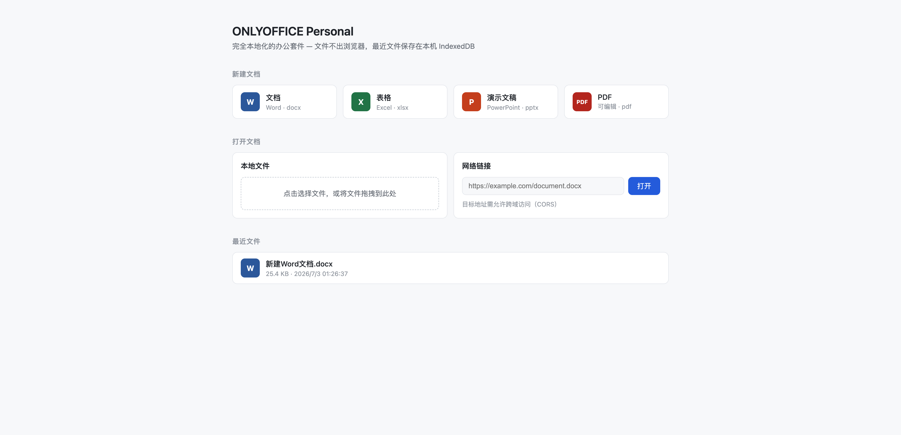
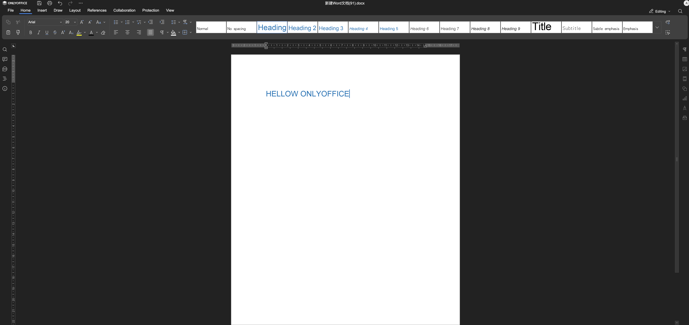
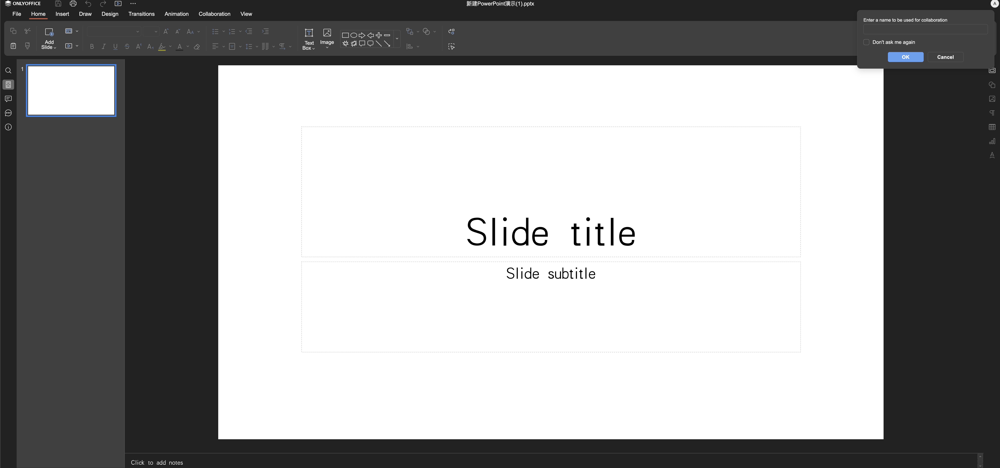
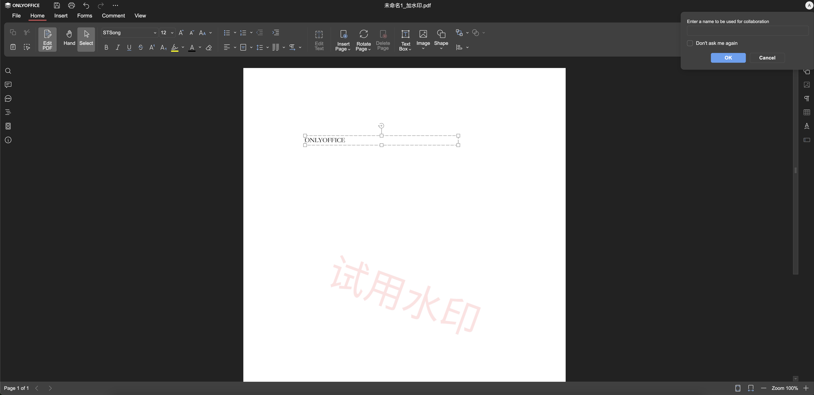

# ONLYOFFICE Personal (fork)

[](LICENSE.txt)
[](https://github.com/fernfei/OnlyofficePersonal)

ONLYOFFICE running offline, entirely in the browser. It uses `x2t.wasm` for document conversion, so there is no Document Server and no backend of any kind — open a static page and you can edit Word, Excel, PowerPoint and PDF files, with everything staying on your machine.

> **About this fork**: this project is a fork of [fernfei/OnlyofficePersonal](https://github.com/fernfei/OnlyofficePersonal) (snapshot of the `9.3.0.133` build, archive notes in [UPSTREAM.md](UPSTREAM.md)). On top of it, the vanilla-JS demo page has been rebuilt as a Vue 3 shell app, and the deployable output has been slimmed down.

[中文](README.md)



## What this fork changes

- **Shell rebuilt**: the vanilla-JS demo page `office.html` is now a Vue 3 + TypeScript + Pinia + Vue Router SPA (`shell/`). Create / open / recent files / editor are all proper components; recent files live in IndexedDB and survive refresh via deep links (`/edit/:id`).
- **Slimmer deploy output**: the engine's built-in help documents are excluded at build time (-504 MB / -15,000 files; the in-editor help panel is empty by design). Deployed file count: 17,686 → 2,645.
- **Caching strategy**: hashed Vite output lives in its own `/app/` directory with immutable caching; the engine directory is content-addressed by version.
- **Engineering**: TypeScript strict + vue-tsc, ESLint 9 flat config, Prettier, and a discriminated-union TypeScript typing of the postMessage protocol.

## Highlights

- **No server**: opening, editing and exporting all happen in the browser; no file is ever uploaded.
- **Format support**: docx / xlsx / pptx and their ODF/CSV counterparts; PDF supports annotations, form filling and text editing.
- **Embeddable**: `onlyoffice.html` exposes a postMessage protocol so you can embed it in your own app and get the edited file back as a byte stream.
- **Static only**: host it on any static server, or bundle it straight into a frontend project.

Built from ONLYOFFICE 9.3, with the bundled **`x2t.wasm` upgraded to the latest 9.4 release**.

## Quick start

The shell project lives in `shell/` and needs Node.js 22+:

```bash
cd shell
npm install

npm run dev        # dev server at http://localhost:5173 (engine assets mounted by dev middleware)
npm run build      # full build: typecheck + vite build + engine copy → shell/dist/
npm run preview    # preview the build at http://localhost:4173
```

> `npm run build` copies the engine output (~660 MB) from the repository root into `shell/dist/`. The built directory is a complete deployable site. Rebuilds are incremental: unchanged engine directories are skipped within seconds.

## Screenshots

Word document



Excel spreadsheet


PowerPoint presentation



PDF editing



## Integrating into your own app

Copy the build output (`shell/dist/`) into your frontend's static folder, embed the `/embed` route in an iframe, then inject documents and retrieve file streams over postMessage.

- **[Integration guide](docs/使用文档.md)** (Chinese): the three ways to integrate, docConfig options, the message protocol, saving file streams, rename, save-as, the Automation API connector, plus a Vue component wrapper.
- **[How the file stream works](docs/集成教程-文件流提取.md)** (Chinese): the offline build has no save callback — this explains how the bytes are pulled out of `x2t.downloadFile`.
- **[Deployment & compression](docs/部署优化-资源压缩.md)** (Chinese): `x2t.wasm` is 40 MB; precompression + strong caching cuts transfer size to 6.6 MB (-84%), with `precompress.sh` usage and Nginx config.

## Project structure

```
onlyoffice-static/
├── 9.3.0.133-*/          # ONLYOFFICE build (web-apps / sdkjs / fonts)
├── assets/               # favicon, blank PDF and other engine-contract static assets
├── blank/                # blank templates for creating new documents
├── docs/                 # documentation and screenshots
├── shell/                # shell project: Vue 3 + TS SPA (home /, editor /edit/:id, embed /embed)
│   └── dist/             # build output = complete deployable site
├── _headers / _redirects # Cloudflare Pages caching and SPA fallback rules (ready, not yet enabled)
└── precompress.sh        # static asset precompression script (for Nginx brotli_static)
```

## Deployment

The output is a purely static site and can be hosted by any static server. `shell/dist/` is the deploy directory: for Nginx config and compression see [部署优化 - 资源压缩](docs/部署优化-资源压缩.md). The Cloudflare Pages configuration (`_headers` / `_redirects`, SPA fallback, brotli rewrite for the 41 MB `x2t.wasm`) is ready and will be enabled once the project matures.

## Acknowledgements

- [fernfei/OnlyofficePersonal](https://github.com/fernfei/OnlyofficePersonal) — the upstream of this project; it provided the ONLYOFFICE 9.3 static build and the initial `onlyoffice.html` integration approach.
- [ONLYOFFICE](https://www.onlyoffice.com/) — authors of the editor and the `x2t.wasm` conversion engine.
- [cryptpad/onlyoffice-x2t-wasm](https://github.com/cryptpad/onlyoffice-x2t-wasm) — source of the upstream x2t.wasm build pipeline.

## License

[AGPL-3.0](LICENSE.txt). ONLYOFFICE components are copyright of [ONLYOFFICE](https://www.onlyoffice.com/).
